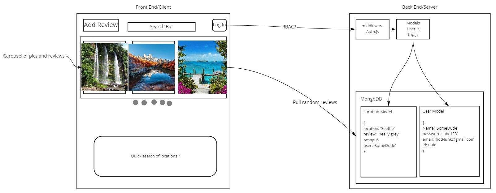

# Project: Vacation Ratings

v 1.0.0

### Deployed on-

[Netlify:](https://vacation-ratings.netlify.app/)

### Web Application-

This application is our version of a vacation rating website for locations of Users. Users will be authenticated & sign into their own accounts where they can add a description of their stay at a location. They will also be able to rate their stay and give other details, like expeneses and duration of their stay. Users will also have the ability to upload an image of that loation. Users will also be able to search the site for other reviews by using the search box at the top of the page.

### Problem Domain-

Provides a site where people can easily see reviews for a specific location along with a rating. Optionally, Users who have left other details like expeneses, duration of their stay, and a photo are available to view as well.

### Tools Used-

- Microsoft Visual Studio
- Auth0
- React
- React-Redux
- React-bootstrap
- Firebase
- Material UI
- Axios

### Getting Started-

To visit and use the site, simply follow the link above. (Found in Deployed on: section)

On local machine use: `git clone git@github.com:Vacation-Ratings/frontend.git`

Then run: `npm install`

### Usage-

As a User, you will be able search for locations of previous reviews left by other Users. Once the User signs in, using Auth0, they will additionally be able to leave a detailed review of a location they have stayed at and include details of expeneses, duration of their stay, an image, and a star rating of 1-5 stars.

.png)

### Data Flow (Frontend, Backend, MongoDB)-

The User will hit the home page and see a carousel of images from MongoDB. If they choose to sign in, Auth0 will authenticate them and create an account if not already in the database. They can also simply use the search box, which will query the DB for the requested location, or if nothing queried, all reviews will be displayed. When logged in, user will be able to leave a review by clicking the "add review" button, will display a form to fill out and then send the data to the DB to add to the other data.

### Credits

Machu Picchu [picture](https://commons.wikimedia.org/wiki/File:Machu_Picchu,_Peru.jpg) on review on home page carousel

### Data Model-

Created by: Keian Anthony, Scott Lease, Michael Metcalf, Jacob Choi
